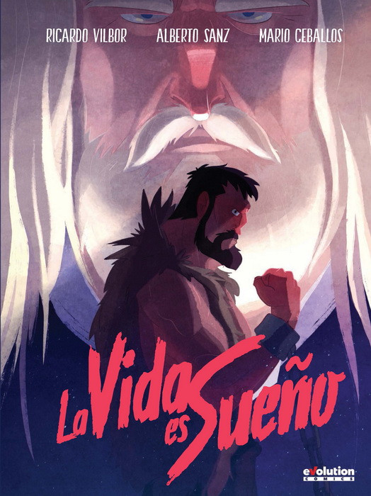

# La vida es Sueño - API
## **Calderon de la Barca**

## Un estudio de una de las mejores obras de teatro universales, escrita en el siglo de oro, converida en API por mi en el siglo XXI. 

# Objetivo
Creación de una API y realización de un análisis de sentimientos de la obra a petición mediante API así con estudio personal del clásico.
Obtención de la obra mediante webScraping por la  utilización de la librería Selenium de Python para sacar la información de paginas web. 

​
# Working plan 
​

​
1. Consegir hacer funcinar el driver de Selenium de manera artesanal. 
2. Aceptado de cookies.
3. Selecion de información a almacenar.
4. Bucles para enriquecimiento de listas de diccionarios.
5. Creacion de DataFrame.
6. Limpieza y transformacion de columnas.
7. Creación de una bases de datos MySQL en local para almacenamiento de los tres actos de la obra. 
8. Exposicion de los mismos en este documento.
​

​
### Estructura del proyecto
​
El proyecto:

a) **LVS_Scra.ipynb** Cuadero de jupyter para donde se implemeta el metodo de Selonilunm para 

b) **/images** --> Carpeta almacen de figuras e imagenes

c) **Archivos Extra** --> Driver de Selenium.exe, carpeta de Seleinum, figuras y csv genreado y fotos de las prendas 

# Libraries
​

[sys](https://docs.python.org/3/library/sys.html)

​

[requests](https://pypi.org/project/requests/2.7.0/)

​

[pandas](https://pandas.pydata.org/)

​

[Seleium](https://selenium-python.readthedocs.io/)

​

[Seaborn](https://seaborn.pydata.org/)

​

[urllib](https://docs.python.org/3/library/urllib.html)